# F&O Market Analysis Tool

## Data Flow Architecture

```mermaid
flowchart TD
    classDef source fill:#f9f,stroke:#333,stroke-width:2px
    classDef process fill:#bbf,stroke:#333,stroke-width:2px
    classDef storage fill:#bfb,stroke:#333,stroke-width:2px
    classDef analysis fill:#fbb,stroke:#333,stroke-width:2px

    subgraph NSE [🌐 NSE Data Sources]
        direction TB
        A1["📊 Bhavcopy\n(F&O Trading Data)"]:::source
        A2["📈 Volatility Data\n(Daily Metrics)"]:::source
        A3["⚠️ Security Ban\n(Trading Restrictions)"]:::source
    end

    subgraph ETL [🔄 Data Processing Pipeline]
        direction TB
        P1["⬇️ Download & Validate\n(HTTP/ZIP)"]:::process
        P2["🔍 Data Cleaning\n(Missing Values, Outliers)"]:::process
        P3["📊 Feature Engineering\n(Percentiles, Signals)"]:::process
        P4["🔄 Data Integration\n(Join & Transform)"]:::process

        P1 --> P2
        P2 --> P3
        P3 --> P4
    end

    subgraph Store [💾 Data Storage Layer]
        direction TB
        S1[("🗄️ MySQL DB\n(Partitioned)")]:::storage
        S2["📁 CSV Files\n(Daily Backup)"]:::storage
        S3["📦 Parquet Files\n(Analytics)"]:::storage
    end

    subgraph Analytics [📊 Analysis & Insights]
        direction TB
        AN1["📊 Volume Patterns\n(Trading Activity)"]:::analysis
        AN2["📈 Volatility Analysis\n(Risk Metrics)"]:::analysis
        AN3["🎯 Trading Signals\n(Buy/Sell)"]:::analysis
    end

    %% Connections with labels
    A1 --> |"Daily Data\nZIP Format"| P1
    A2 --> |"Real-time\nMetrics"| P1
    A3 --> |"Trading\nUpdates"| P1

    P4 --> |"Structured\nData"| S1
    P4 --> |"Backup"| S2
    P4 --> |"Analytics"| S3

    S1 --> |"Query"| AN1
    S1 --> |"Analysis"| AN2
    S1 --> |"Signals"| AN3

    style NSE fill:#f9f9ff,stroke:#333,stroke-width:2px
    style ETL fill:#f0f0ff,stroke:#333,stroke-width:2px
    style Store fill:#f0fff0,stroke:#333,stroke-width:2px
    style Analytics fill:#fff0f0,stroke:#333,stroke-width:2px
```



### Process Flow Description

1. **Data Collection**
   - Download Bhavcopy (F&O trading data)
   - Download Volatility data
   - Download Security Ban information
   - Handle market holidays and weekends

2. **Data Processing**
   - Clean and validate data
   - Calculate daily volatility metrics
   - Compute volume percentiles
   - Generate trading signals

3. **Data Storage**
   - Store in MySQL database with partitioning
   - Save CSV files for backup
   - Save Parquet files for efficient querying

4. **Data Analysis**
   - Volume analysis
   - Volatility trends
   - Trading signal generation
   - Performance metrics

### Database Schema

```mermaid
erDiagram
    fo_market_analysis {
        bigint id PK
        varchar(50) symbol
        date request_date
        date expiry_date
        timestamp processed_timestamp
        decimal(10,4) daily_volatility
        bigint trade_volume
        int percentile_volume
        int percentile_volatility
        decimal(5,2) average_percentile
        varchar(20) average_percentile_desc
    }
```

The database is optimized with:
- Partitioning by request_date
- Indexes on symbol and dates
- Constraints for data integrity

This tool downloads and processes F&O (Futures & Options) market data from the National Stock Exchange of India (NSE) and provides analysis based on volatility and trading volume.

## Features

- Downloads daily bhavcopy, volatility, and security ban data from NSE
- Processes and combines data to generate meaningful insights
- Calculates percentiles for volume and volatility
- Stores processed data in MySQL database
- Handles market holidays and weekends automatically
- Supports both historical and current date processing

## Prerequisites

- Python 3.8 or higher
- MySQL Server
- Required Python packages (install via `pip install -r requirements.txt`):
  - pandas
  - numpy
  - pyarrow
  - mysql-connector-python
  - requests
  - python-dateutil
  - pytz
  - python-dotenv

## Database Setup

1. Create a MySQL database named `fo_market_data`
2. The tool will automatically create the required table `fo_market_analysis`
3. Update database credentials in `config.py`

## Usage

1. Process data for a specific date:
```bash
python combine_code.py --date YYYY-MM-DD
```

2. Process data for current date:
```bash
python combine_code.py
```

## Output

The tool generates three types of output:
1. CSV files in `data/Output/YYYYMM/`
2. Parquet files in `data/Output_Parquet/YYYYMM/`
3. Database entries in the `fo_market_analysis` table

### Database Schema

- `id`: Auto-incrementing primary key
- `symbol`: Stock symbol
- `request_date`: Date of the data
- `expiry_date`: F&O contract expiry date
- `processed_timestamp`: When the data was processed
- `daily_volatility`: Daily volatility value
- `trade_volume`: Trading volume
- `percentile_volume`: Volume percentile (1-100)
- `percentile_volatility`: Volatility percentile (1-100)
- `average_percentile`: Average of volume and volatility percentiles
- `average_percentile_desc`: Descriptive category (Very Low/Low/Moderate/High/Very High)

## Data Sources

The tool fetches data from the following NSE sources:
1. Bhavcopy: Daily F&O trading data
2. Volatility: Daily volatility data
3. Security Ban: List of securities under F&O ban

## Logging

Logs are stored in `logs/bhavcopy.log` with detailed information about:
- Data download status
- Processing steps
- Database operations
- Any errors or warnings

## Version Control

The repository includes a `.gitignore` file that excludes:
- Generated data files (`data/Output/`, `data/Output_Parquet/`)
- Log files (`logs/*.log`)
- Python cache and virtual environment files
- IDE-specific files
- System files (e.g., `.DS_Store`)
- Local configuration files

This ensures that only source code and essential configuration files are tracked in version control.
